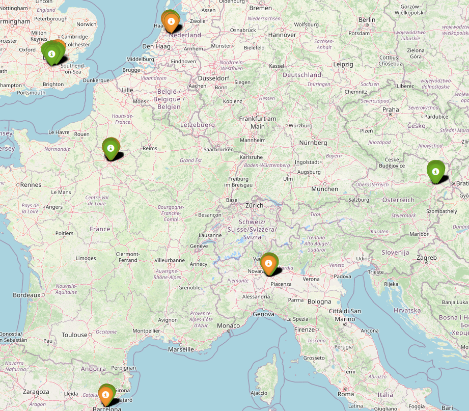

# DSC511 Group Project: Hotel Review Sentiment Analysis and Rating Prediction

## Authors

- Maria Tsilidou
- Anastasios Nikodimou
- Ioannis Demetriou

## Abstract

In the era of digital transformation, online hotel reviews have become a
significant factor in shaping travelers' booking decisions. Reviews provide
firsthand experiences from guests, offering insights into hotel quality,
customer satisfaction, and areas of improvement. Using data collection,
aggregation and processing techniques we seek to formulate and answer
questions related to hotel ratings, customer sentiment, and prediction modeling.

## Manifest

This project contains:

- The [dataset](./data/Hotel_Reviews.csv.gz)
- Complimentary dataset of [countries](./data/countries.csv), sourced from [google](https://developers.google.com/public-data/docs/canonical/countries_csv)
- The [jupyter notebook](./dsc511.project.mtsilidou.anikodimou.idemetriou.ipynb) used to analyse the dataset.

## Dataset

The analysis will use the "515k Hotel Reviews Data in Europe" dataset obtained from
[here](https://www.kaggle.com/datasets/jiashenliu/515k-hotel-reviews-data-in-europe)
at the time of writing, it contains over 500k reviews, scraped from Booking.com,
scoring **1493 luxury hotels** across Europe. Each review includes 17 features,
including textual feedback and scoring, reviewer nationality, hotel location,
providing diverse data types for analysis.

### Understanding the dataset

The dataset appears to be the "exploded" join of a hotel, reviewer and review
table. In particular,

Hotel:

- `Hotel_Name`: Name of Hotel
- `Hotel_Address`: Address of hotel.
- `lat`: Latitude of the hotel
- `lng`: longtitude of the hotel
- `Average_Score`: Average Score of the hotel, calculated based on the latest comment in the last year.
- `Total_Number_of_Reviews`: Total number of valid reviews the hotel has.

Reviewer:

- `Reviewer_Nationality`: Nationality of Reviewer
- `Total_Number_of_Reviews_Reviewer_Has_Given`: Number of Reviews the reviewers has given in the past.

Review:

- `Review_Date`: Date when reviewer posted the corresponding review.
- `Negative_Review`: Negative Review the reviewer gave to the hotel. If the reviewer does not give the negative review, then it should be: 'No Negative'
- `Review_Total_Negative_Word_Counts`: Total number of words in the negative review.
- `Positive_Review`: Positive Review the reviewer gave to the hotel. If the reviewer does not give the negative review, then it should be: 'No Positive'
- `Review_Total_Positive_Word_Counts`: Total number of words in the positive review.
- `Reviewer_Score`: Score the reviewer has given to the hotel, based on his/her experience
- `Tags`: Tags reviewer gave the hotel.
- `days_since_review`: Duration between the review date and scrape date.
- `Additional_Number_of_Scoring`: There are also some guests who just made a scoring on the service rather than a review. This number indicates how many valid scores without review in there.

### Feature Engineering

Our dataset contained some duplicate rows, and we have removed them.

Our dataset contains empty values that are not treated as null.
Investigation showed that this is because the dataset did not use "default"
values to indicate `NULL` in the dataset so spark did not understand them.
Empty strings is not the only "not-null" null values a string can have.
In many datasets missing values can be represented as 'NA' (a string) instead of null.
Spark won’t treat 'NA' as a missing value unless we explicitly handle it.
So if we're only checking for null, we might miss those 'not-null nulls'.
This is why we need to check each column for the presence of 'not-null' nulls.

In fact, `lon`, `lat` contained "NA" for missing values, while
`Negative_Review` and `Positive_Review` contained "No Positive", "No Negative", etc.

We manually casted features to an appropriate data format where pyspark
could not do so automatically. In particular we casted `days_since_review` for a
string to a `DateTime` object, the coordinates to numerical decimal degrees.

We also introduced the `Country` feature, which we extracted from the `Hotel_Address`

## Geospatial

We will try to understand the physical distribution of the hotels.

The hotels are located in:

- Vienna, Austria
- Paris, France
- Amsterdam, Netherlands
- Barcelona, Spain
- Milan, Paris
- London, United Kingdom

Most of the hotels and reviews are from London.

| Country | Number of Hotels |
| ------- | ---------------- |
| NL      | 105              |
| AT      | 158              |
| GB      | 400              |
| ES      | 211              |
| FR      | 458              |
| IT      | 162              |

| Country | Number of Reviews |
| ------- | ----------------- |
| NL      | 57211             |
| AT      | 38937             |
| GB      | 262298            |
| ES      | 60149             |
| FR      | 59413             |
| IT      | 37204             |

For interactive map see [here](./results/hotels.html)

## Reviews

We image the reviews where collected using a form with this basic functionality:

## Models

For detailed information about the models produced see the companion
[jupyter notebook](./dsc511.project.mtsilidou.anikodimou.idemetriou.ipynb)

## Conclusions

This report has analysed the "515k Hotel Reviews Data in Europe" dataset, which
exhibited a generally structured format. The challenge with the preprocessing
stage was in in the positive and negative reviews, which needed to be mitigated
before further analysis.

The dataset consists reviews from hotels from 6 European cities, favoring London
based establishments. Reviewer nationality is also are unbalanced favoring
English talking nations. We can hypothesise that this is because the dataset
maintainers engineered it to only contain English reviews.

The unstructured textual data in the form of guest reviews split it positive
and negative, along with "tags". This was analyzed using natural language
processing (NLP) techniques.

The big data volume of data was addressed by taking samples from the main
dataset favoring hotels with more reviews. This was due to computational
restrictions from our part.

Graph-based analysis of review frequency identified the hotels receiving the
highest number of reviews

We regressed our dataset on the average hotel rating using Linear Regression,
Random Forest, and Gradient Boosted Trees. Linear Regression demonstrated the
superior performance metrics on this aggregated dataset, achieving the lowest
Root Mean Squared Error (RMSE = 0.3766) and the highest coefficient of
determination (R² = 0.4892). The Random Forest and Gradient Boosted Trees,
exhibited slightly inferior performance compared to Linear Regression.
This outcome may indicate that the non-linear modeling capabilities of these
algorithms did not provide a significant advantage on the specific patterns
present in the aggregated data.

We performed sentiment analysis using the provided `Positive_Review` and `Negative_Review`
as labels, and lemmatized tokens in the reviews as inputs. We trained and validated
our dataset using an 80-20 split using Logistic Regression, and achieved an 89%
accuracy and F1-score, indicating a good balance between precision and recall.
We demonstrated how an example review can predict whether it is positive or negative.
Application of this is a customer feedback monitoring, which can automatically label
the review for the user, providing feedback as to where they want to classify their
review. Also since LR offers probabilities, a real-time alert can be triggered for
negative reviews over a threshold.

We then aggregated the numerical features over each hotel, reducing the dataset size
to around 50000. We then move to classify the "star" rating of the hotel given
these numerical features, where stars is an engineered feature scaling the existing
reviews from 1 to 5 stars. We used a Random Forest Classifier, which seemed to show
bias towards 4 star hotels, which is reflected by the fact that the engineered dataset
is unbalanced with 4 star ratings.

Finally we performed clustering using K-means, providing as input the average
rating, number of words and tags. Using the elbow rule, we selected 4 clusters as
a hyperparameter, which minimizes the WSS. The PCA projection of clusters shows a
clean separation between the clusters.

## Future work

The analysis performed here cut many corners computationally speaking to avoid
training with huge amount of data. We can finalize a selected model and train on
the entirety of the dataset.

The dataset does not contain information like reviewer ID or review date. This
limitations stop us from performing collaborative filtering for a recommendation
system, and exploring seasonality trends respectively. A future work with this
information could:

- produce a content-user recommendation system
- explore seasonalities
